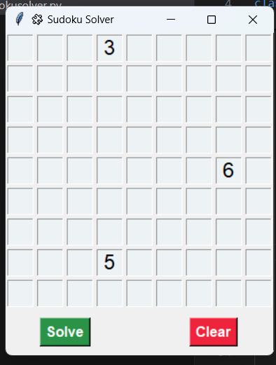

# 🧩 Sudoku Solver - Python Tkinter GUI

A Python program that solves Sudoku puzzles using a backtracking algorithm and provides an easy-to-use GUI built with Tkinter.

---

## 🖥️ Features

- Interactive 9x9 Sudoku grid for input
- Solves valid puzzles using backtracking
- Clean and minimal Tkinter interface
- One-click **Solve** and **Clear** buttons

---

## 🚀 How to Run

1. Clone the repository or download the Python file.
2. Ensure you have Python 3 installed.
3. Run the app using:

```bash
python sudoku_solver.py

📸 Screenshot


🧠 How It Works
Uses a recursive backtracking algorithm to solve the puzzle

Validates row, column, and 3x3 box constraints

Displays results directly in the UI

📂 Project Structure
sudoku_solver.py
README.md
screenshot.png   ← (You add this!)

🛠️ Requirements
Python 3.x

Tkinter (comes pre-installed with Python)

🤝 Contributing
Feel free to fork the repo and suggest improvements or features!

📃 License
This project is open-source and free to use.